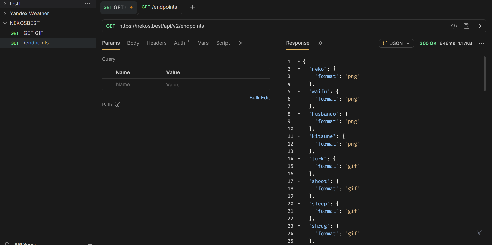
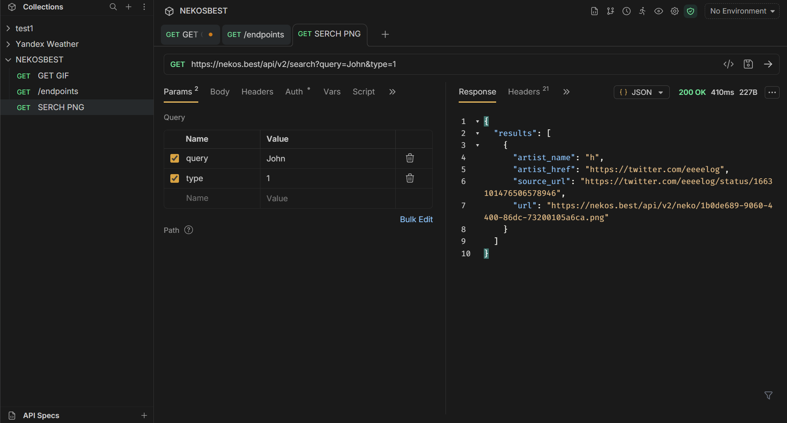
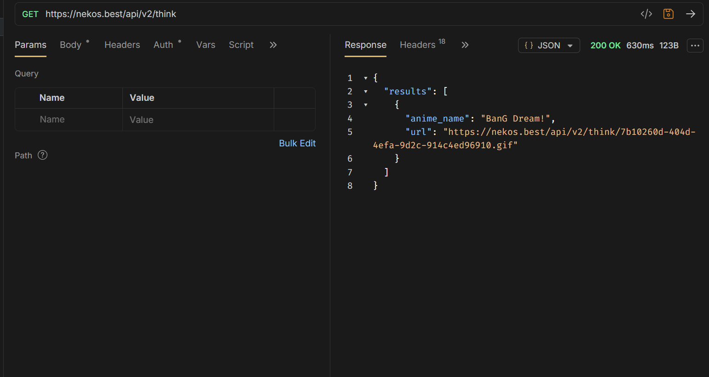
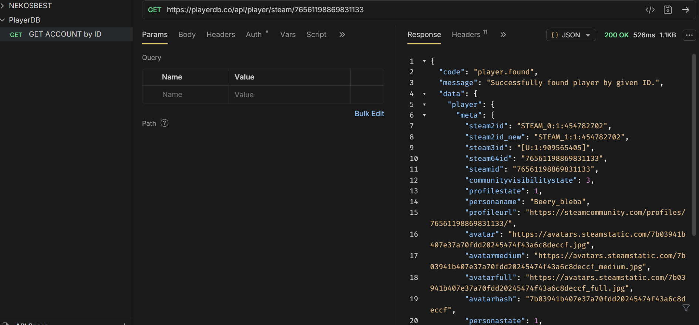
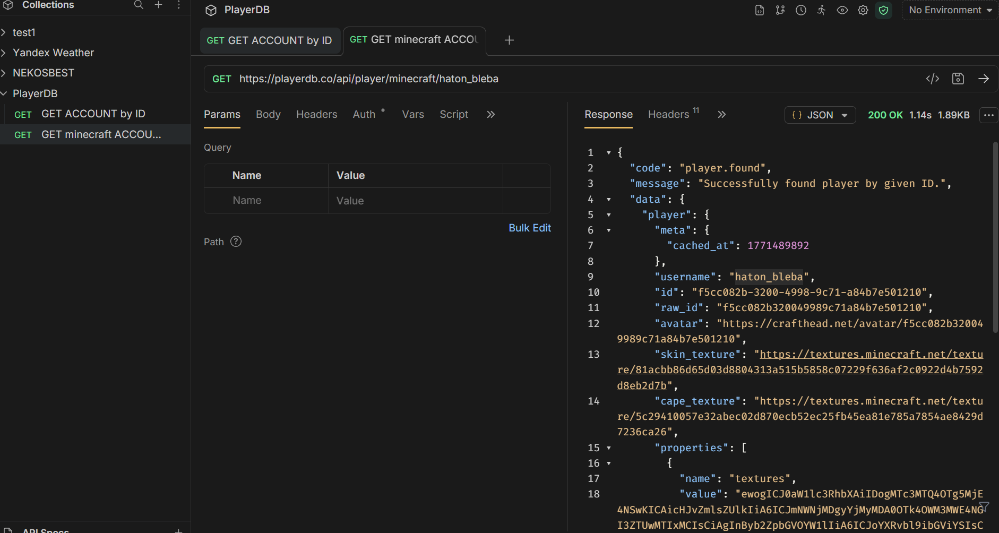

# Работа с api из 2 практики
## 1. Получение всех товаров

## 2. Получение товара по id

## 3. Удаление товара по id  

## 4. Добавление товара

# Работа с api из списка, [открыть API](https://github.com/public-apis/public-apis)
## 1. Получаем все доступные категории API и соответствующие им форматы файлов. 
[API NekosBest](https://docs.nekos.best/getting-started/api-endpoints.html)

## 2. Поиск изображения изображения по автору jonh.  
[API NekosBest](https://docs.nekos.best/getting-started/api-endpoints.html)

## 3. Получение ссылки на GIF файл из категории think.
[API NekosBest](https://docs.nekos.best/getting-started/api-endpoints.html)

## 4. Получение информации об аккаунте steam по id пользователя.
[PlayerDB](https://playerdb.co/)

## 5. Получение информации об аккаунте игрока minecraft по id (никнейму).
[PlayerDB](https://playerdb.co/)
